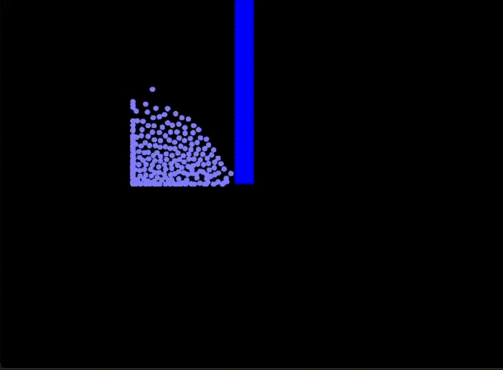

# 3D SPH Fluid Simulation

A real-time 3D Smoothed Particle Hydrodynamics (SPH) fluid simulation implemented in Python using OpenGL for visualization.


## Description

This project implements a particle-based fluid simulation using the SPH method. The simulation features:

- Real-time 3D visualization using OpenGL
- Interactive camera controls
- Dam break scenario simulation
- Particle pressure and velocity visualization
- Physics-based fluid behavior including:
  - Surface tension
  - Pressure forces
  - Viscosity
  - Gravity
  - Wall constraints
  - Velocity damping

## Installation

1. Clone the repository:
```bash
git clone https://github.com/amirrezaes/3D-Fluid-Simulation-Pygame
cd 3D-Fluid-Simulation-Pygame
```

2. Create and activate a virtual environment (optional but recommended):
```bash
python -m venv venv
source venv/bin/activate  # On Windows: venv\Scripts\activate
```

3. Install the required dependencies:
```bash
pip install -r requirements.txt
```
make sure you have the pyopengl folder

## Usage

Run the simulation: inside the 3D-Fluid-Simulation-Pygame folder run:
```bash
python sph
```
you can adjust the particle count in config.py if your system can not handle defult value.
### Controls

- **Arrow Keys**: Rotate camera view
  - Up/Down: Rotate around X-axis
  - Left/Right: Rotate around Y-axis
- **Q/E**: Zoom in/out
- **V**: Switch to velocity-based particle coloring
- **P**: Switch to pressure-based particle coloring
- **ESC**: Exit simulation

## Features

- **Particle System**: Uses a vectorized particle system for efficient computation
- **Real-time Physics**: Implements SPH algorithm with:
  - Density calculation
  - Pressure forces
  - Viscosity forces
  - Surface tension
- **Visualization**:
  - Smooth particle rendering
  - Color coding based on particle properties
  - 3D environment with walls and dam
  - Real-time FPS and memory usage display
- **Performance**:
  - Optimized neighbor search
  - Vectorized calculations using NumPy
  - Efficient OpenGL rendering

#### Velocity Colors


#### Pressure Colors


## Technical Details

- Written in Python 3
- Uses PyOpenGL for 3D rendering
- Pygame for window management and user input
- NumPy for efficient numerical computations
- Implements Leapfrog integration for particle physics

## Requirements

- **Python 3.9 - 3.12 (pyOpenGL might not install in other versions, tested on 3.10 only)**
- NumPy
- Pygame
- PyOpenGL
- PyOpenGL_accelerate
- psutil

## Performance Notes

The simulation performance depends on:
- Number of particles (configured in config.py)
- Hardware capabilities
- Screen resolution
- Particle size and rendering settings

## Evolutions:



